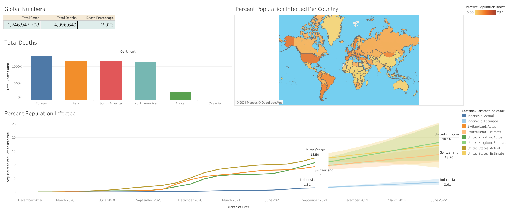

# Covid19 Dashboard Visualization
This project is the second part of [Covid19 Data Exploration](https://github.com/AndreasDeSousa/Data_Science_Analysis_Projects/tree/main/Exploratory%20Data%20Analysis%20(EDA)/SQL/Covid-19) project. 
In this part we will focus on extract the data from a database, formatting and visualizing the data
with Tableau. The final result will be a Dashboard showing the current cases by country
and the History of the infection vs the Population.

